# [터득 🖱️](https://toudeuk.kr/)

## Index

#### &emsp; [➤ 프로젝트 소개](#프로젝트-소개)<br>

#### &emsp; [➤ 프로젝트 설계](#프로젝트-설계)<br>

#### &emsp; [➤ 기능 소개](#기능-소개)<br>

#### &emsp; [➤ 프론트엔드 구현 과정](#프론트엔드-구현-과정)<br>

#### &emsp; [➤ 백엔드 구축 과정](#백엔드-구축-과정)<br>

#### &emsp; [➤ 산출물](#산출물)<br>

<br>

# 프로젝트 소개

- ## 기획 배경

  '터득'은 특정 조건에 따라 선정된 회원에게 보상을 지급하는 클릭 게임으로, 사용자에게 재미와 보상을 제공하는 서비스입니다.
  <br><br>
  이 서비스는 선착순 쿠폰 발행, 멤버십 리워드, 한정 이벤트와 같은 고객 참여형 프로그램을 운영하는 기업들에게 솔루션을 제공할 목적으로 개발되었습니다.

- ## 서비스 소개

  ### 이벤트성 클릭 게임 플랫폼

  1. 최다 클릭 회원, 마지막 클릭 회원 등 특정 조건에 따라 선정된 회원에게 보상을 지급하는 플랫폼

  2. 실시간으로 게임 진행 상황을 확인하고 참여할 수 있는 인터랙티브 플랫폼

  3. 적립한 포인트를 통해 다양한 기프티콘을 구매할 수 있는 리워드 시스템

  4. 트래픽과 동시성 처리를 고려한 안정적인 아키텍처

<br>

- ## 프로젝트 기간

  | 프로젝트 기간 | 2024.10.14 ~ 2024.11.29 (7주) |
  | ------------- | ----------------------------- |

  <br>

- ## 팀 소개

  | Contributors | Role | Position                                     |
  | ------------ | ---- | -------------------------------------------- |
  | 박보람       | 팀장 | - UI/UX디자인<br> - 퍼블리싱<br>- 프론트엔드 |
  | 　김연지     | 팀원 | - UI/UX디자인<br> - 퍼블리싱<br>- 프론트엔드 |
  | 　양준영     | 팀원 | - 백엔드 리더                                |
  | 　이인준     | 팀원 | - 백엔드                                     |
  | 　정하림     | 팀원 | - 백엔드                                     |
  | 　황성민     | 팀원 | - Infra<br> - 백엔드                         |

<br>

# 프로젝트 설계

- ## 개발 환경

  FE: Next.js 14.2, TypeScript, Zustand  
  BE: Java 17, SpringBoot 3.3.3, Apache Kafka  
  DB: Redis 7.4 MySQL 8.0  
  Infra: Ubuntu 20.04, Docker

  <h3>Frontend</h3>
  <p>
  
  
  
  
  

  </p>
  <h3>Backend</h3>
  <p>
  
  
    
  </p>

  <h3>Database</h3>
  <p>
    
  
  </p>

  <h3>Infra</h3>
  <p>
   
   
   
  
  <br>

  <h3>성능 테스트 & 모니터링</h3>
  <p>
  
  
    
  </p>

    <h3>ETC</h3>
  
  
  </p>

  <h3>협업 툴</h3>
  <p>
  <a href="">
  
  <a href="https://www.notion.so/C202-11f9285c91d880829416f709f4432732">
  
  </a>
  </p>

<br>

<br>
  
<br>

# 기능 소개

  <!-- 1. 최다 클릭 회원, 마지막 클릭 회원 등 특정 조건에 따라 선정된 회원에게 보상을 지급하는 리워드 시스템

  2. 실시간으로 게임 진행 상황을 확인하고 참여할 수 있는 인터랙티브 플랫폼
  
  3. 적립한 포인트를 통해 다양한 기프티콘을 구매 -->

- ### **1.&nbsp; 클릭 게임**

  <p style='font-size:16px; font-weight:bold;'>1.1 게임 몰입감 강화 요소</p>
  <p style='font-size:16px;'>&emsp;1.1.1 당첨 이펙트</p>
  <p style='font-size:16px;'>&emsp; 당첨자에게 이펙트 효과를 제공함으로써 흥미와 만족감을 느끼게 하고 보상 심리 강화를 통해 게임에 대한 지속적인 참여를 유도했습니다.</p>
  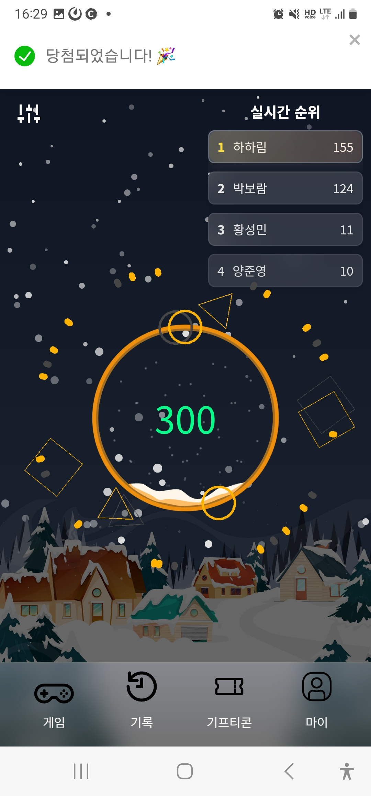
  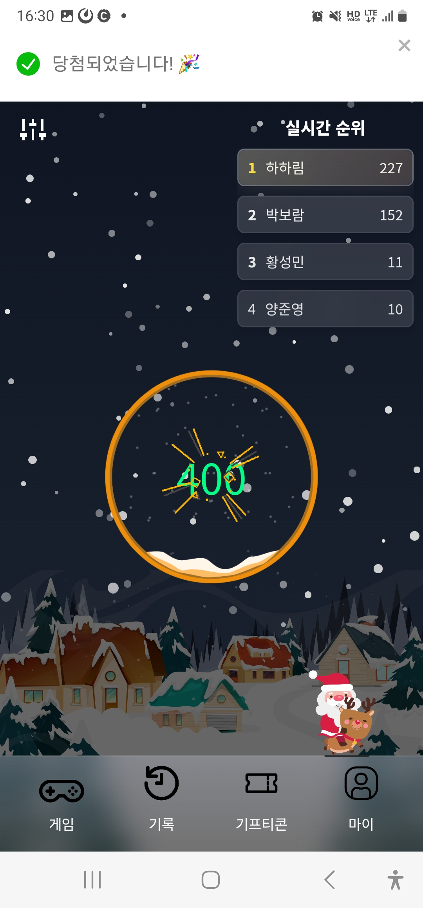
  <br><br>

  <p style='font-size:16px; '>&emsp;1.1.2 실시간 랭킹</p>
  <p style='font-size:16px;'>&emsp; 랭킹을 통해 경쟁심을 유발하고 실시간으로 변화하는 순위를 통해 역동적인 사용자 경험을 제공합니다.</p>
  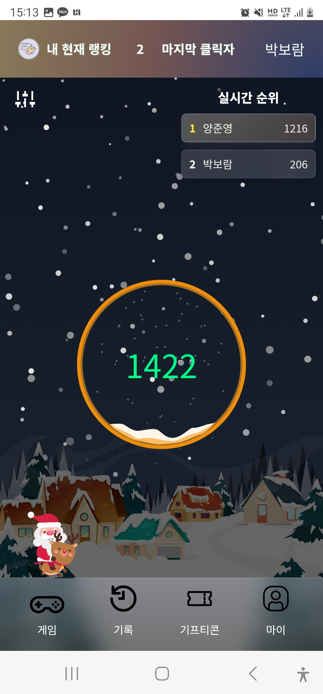
  <br><br>

  <p style='font-size:16px; '>&emsp;1.1.3 배경음과 버튼 클릭음</p>
  <p style='font-size:16px;'>&emsp; 버튼 클릭음을 통해 몰입감을 높이고, 독창적인 배경음을 활용하여 사용자가 게임을 기억하게 함으로써 브랜드 아이덴티티를 강화합니다.</p>
  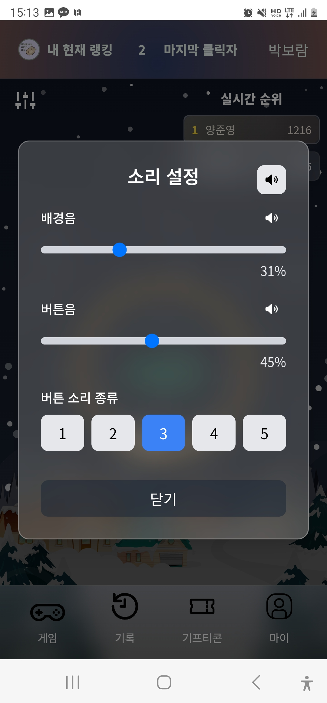
  <br><br>

<br>
  
* ### **2.&nbsp; 게임 히스토리**
  <p style='font-size:16px; font-weight:bold;'>2.1 게임 기록 </p>
  <p style='font-size:16px;'>&emsp; 모든 라운드의 게임의 우승자를 확인할 수 있습니다.</p>
  <p style='font-size:16px;'>&emsp; 디테일 페이지를 통해 한 라운드에 대해 첫번째부터 1000번째까지 누가 눌렀는지 모든 기록을 확인 할 수 있습니다.</p>
  <p style='font-size:16px;'>&emsp;Rendering 시간을 최적화 하기 위해 무한 스크롤로 구현했습니다 😀</p>
  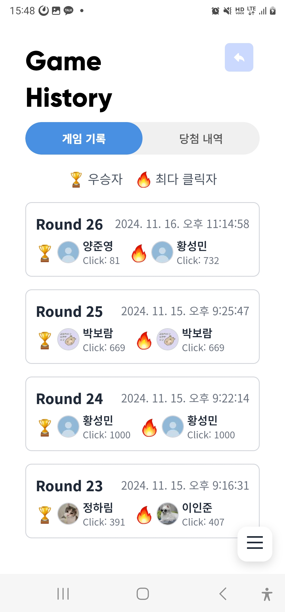
  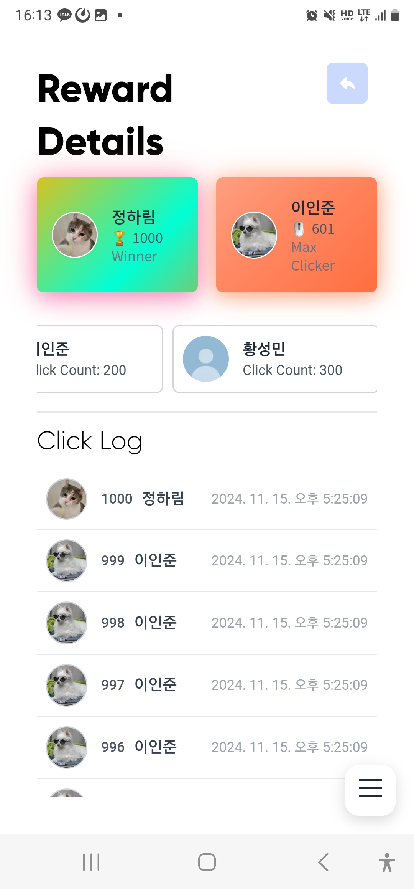
  <br><br>

  <p style='font-size:16px; font-weight:bold;'>2.2 당첨 내역 </p>
  <p style='font-size:16px;'>&emsp; 내가 참여한 게임의 당첨 내역을 확인할 수 있습니다.</p>
  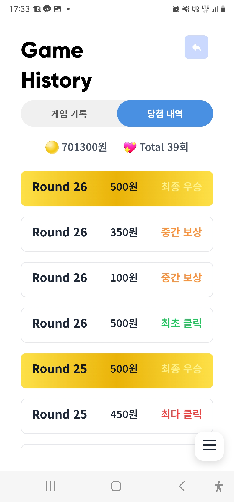
  <br><br>
<br>
  
* ### **3.&nbsp; 기프티콘 구매 및 사용**

  <p style='font-size:16px;'>&emsp; 특정 브랜드와의 기프티콘 제휴를 통해 광고 수익과 공동 마케팅 기회를 확보하여 수익성을 더욱 강화하는 비즈니스 모델을 구현했습니다.</p>

  <p style='font-size:16px; font-weight:bold;'>3.1 기프티콘 샵</p>
  <p style='font-size:16px;'>&emsp; 사용자가 원하는 기프티콘을 쉽게 찾을 수 있도록 카테고리 필터를 제공합니다.</p>
  
  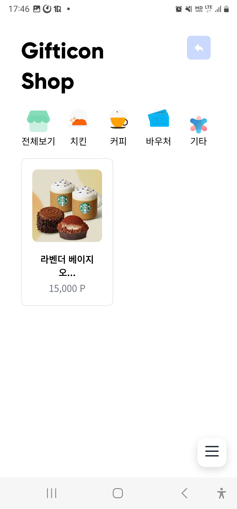
  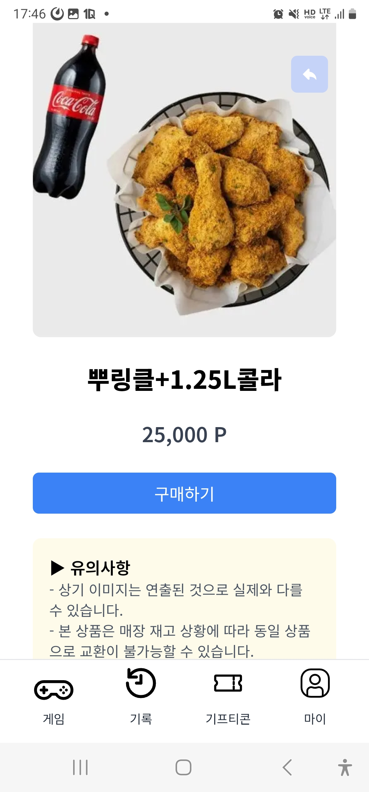
  <br><br>

  <p style='font-size:16px; font-weight:bold;'>3.2 나의 기프티콘</p>
  <p style='font-size:16px;'>&emsp; 사용자가 구매한 기프티콘을 확인할 수 있습니다.</p>
  <p style='font-size:16px;'>&emsp; 사용자는 구매한 기프티콘을 카테고리 필터를 통해 쉽게 찾을 수 있고, 교환권 사용하기 버튼을 통해 사용 여부를 쉽게 기록할 수 있습니다.</p>
  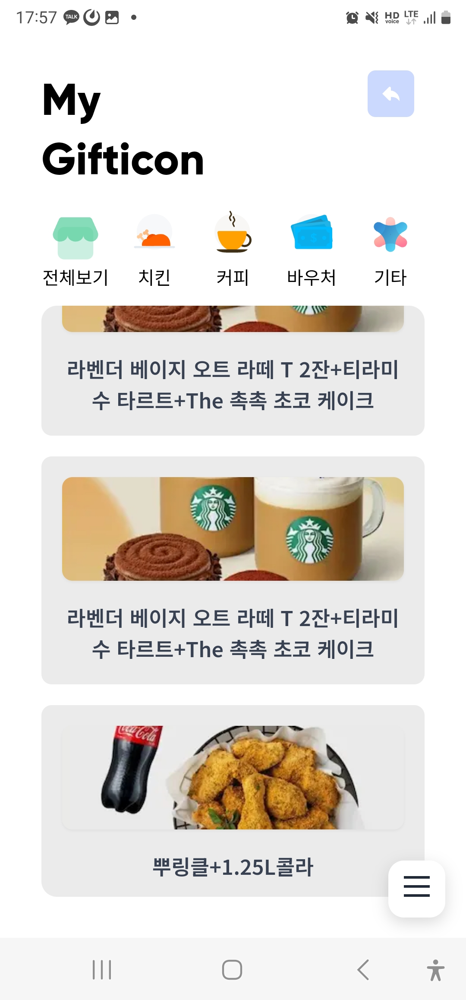
  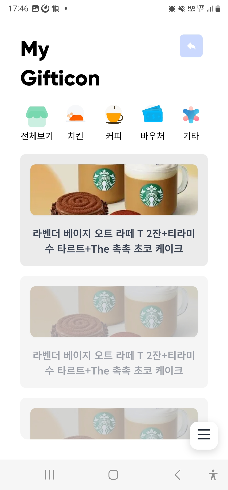
  

<br><br><br>

# 프론트엔드 구현 과정

### **1.&nbsp; 애니메이션 및 제스쳐**

  <p style='font-size:16px;'>&emsp; Framer Motion 사용하여 애니메이션 및 제스쳐를 구현했습니다.</p>

### **2.&nbsp; Music Contol**

  <p style='font-size:16px;'>&emsp; Zustand를 활용하여 배경음, 버튼 클릭음 전역상태 관리 하여 musicContol 기능을 구현했습니다.</p>

### **3.&nbsp; 캐싱 처리**

  <p style='font-size:16px;'>&emsp; react-query를 활용하여 서버 데이터의 캐싱을 처리하고, API 호출 횟수를 최소화하여 성능을 최적화하였습니다.</p>
  <p style='font-size:16px;'>&emsp; 데이터를 효율적으로 관리함으로써 클라이언트와 서버 간 통신 비용을 감소시켰습니다.</p>

### **4.&nbsp; Next image 최적화**

  <p style='font-size:16px;'>&emsp; 각 페이지의 LCP(Large Contentful Paint) 요소로 판단되는 주요 이미지에 priority 속성을 적용하였습니다.</p>
  <p style='font-size:16px;'>&emsp; 이미지 로딩 속도 최적화를 통해 사용자 경험 및 SEO 성능을 개선하였습니다.</p>
  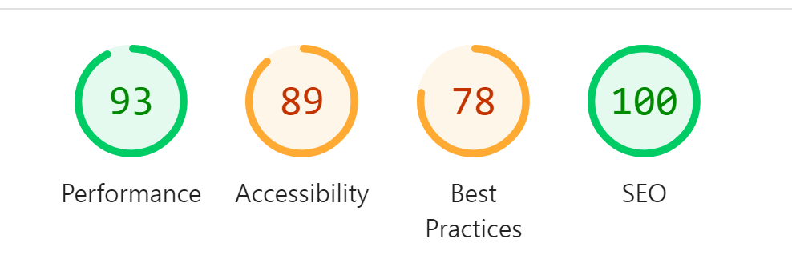
  
### **5.&nbsp; pwa 환경에서 드래그 구현**
  <p style='font-size:16px;'>&emsp; MouseEvent와 TouchEvent를 활용하여 데스크톱과 모바일에서 모두 호환되는 드래그 기능을 구현하였습니다.</p>

# 백엔드 구축 과정 및 성능 테스트

## 테스트 조건

```java
server.tomcat.threads.max=200
server.tomcat.threads.min-spare=10
spring.datasource.hikari.maximum-pool-size=10
spring.datasource.hikari.minimum-idle=10
```

# Vuser

total : 100

init : 25 (100초 마다 25명씩 증가)

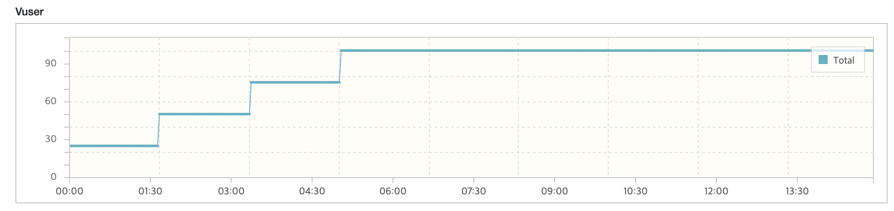

<br><br><br><br>

### **1-1단계&nbsp; DB 격리 수준 Serializable**

```
Mysql의 DB 트랜젝션 격리 수준을 Serializable로 하여 동시성 문제를 해결합니다.

TPS : 190.6
Peak TPS :  220
MTT : 436.50 ms
```

### TPS


### MTT


<br><br><br><br>

### **1-2단계&nbsp; MySQL + Pessimistic Lock(비관락)**

```
클릭이 동시에 일어나는 게임행의 클릭 카운트에 비관적 락을 걸어 동시성 문제를 해결합니다.
TPS : 78.4
Peak TPS :  96
MTT : 1,061.24 ms
```

### TPS


### MTT


<br><br><br><br><br>

### **2단계&nbsp; Redis + MySQL**

```
싱글 스레드로 작동하는 레디스를 이용하여 동시성 문제를 해결합니다.
TPS : 328.0
Peak TPS :  381
MTT : 253.95 ms
```

### TPS


### MTT


<br><br><br><br>

### **3단계&nbsp; Redis + 내부 Kafka + MySQL (Kafka 파티션: 1개)**

```
짧은 시간에 몰리는 DB 쓰기 요청에 대해 안정성을 확보하기 위해 Kafka 메시징 큐를 이용하였습니다.
```

### TPS


### MTT


<br><br>

# 산출물

#### [⚙️ Architecture](./README-IMG/Architecture.png)

#### [⚙️ ERD](./README-IMG/ERD.png)

#### [📑 요구사항 명세서](https://www.notion.so/11f9285c91d881988b8df4d7152b1611)

#### [📑 API 명세서](./README-IMG/API_DOCS.pdf)

<br><br>
